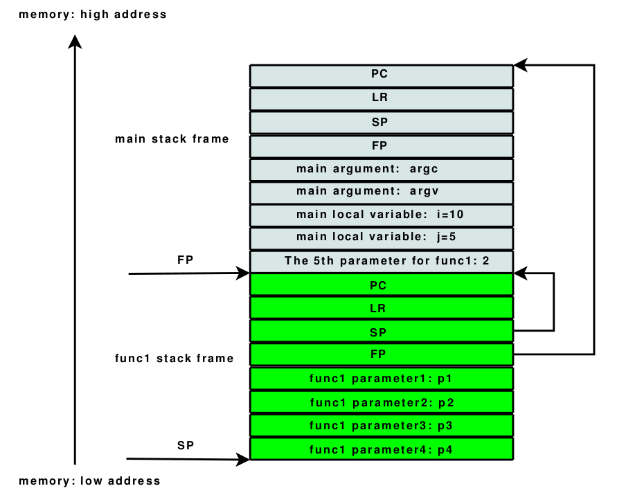
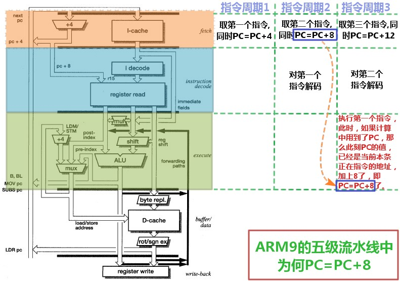

# ARM 寄存器简介
ARM处理器共有37个寄存器。其中包括：31个通用寄存器，包括程序计数器(PC)在内，这些寄存器都是32位寄存器；以及6个32位状态寄存器，但目前只使用了其中12位。ARM处理器共有7种不同的处理器模式，在每一种处理器模式中有一组相应的寄存器组。任意时刻(也就是任意的处理器模式下)，可见的寄存器包括15个通用寄存器(R0～R14)、一个或两个状态寄存器及程序计数器(PC)。在所有的寄存器中，有些是各模式共用的同一个物理寄存器，有一些寄存器是各模式自己拥有的独立的物理寄存器。  
下表列出了各处理器模式下可见的寄存器情况，寄存器详细可参考 [AAPCS §5.1.1 Core registers](http://infocenter.arm.com/help/topic/com.arm.doc.ihi0042e/IHI0042E_aapcs.pdf)。    
<table>
<tbody>
<tr>
  <td>User</td>

  <td>System</td>

  <td>Supervisor</td>

  <td>Abort</td>

  <td>Undefined</td>

  <td>IRQ</td>

  <td>FIQ</td>
</tr>

<tr>
  <td>R0</td>

  <td>R0</td>

  <td>R0</td>

  <td>R0</td>

  <td>R0</td>

  <td>R0</td>

  <td>R0</td>
</tr>

<tr>
  <td>R1</td>

  <td>R1</td>

  <td>R1</td>

  <td>R1</td>

  <td>R1</td>

  <td>R1</td>

  <td>R1</td>
</tr>

<tr>
  <td>R2</td>

  <td>R2</td>

  <td>R2</td>

  <td>R2</td>

  <td>R2</td>

  <td>R2</td>

  <td>R2</td>
</tr>

<tr>
  <td>R3</td>

  <td>R3</td>

  <td>R3</td>

  <td>R3</td>

  <td>R3</td>

  <td>R3</td>

  <td>R3</td>
</tr>

<tr>
  <td>R4</td>

  <td>R4</td>

  <td>R4</td>

  <td>R4</td>

  <td>R4</td>

  <td>R4</td>

  <td>R4</td>
</tr>

<tr>
  <td>R5</td>

  <td>R5</td>

  <td>R5</td>

  <td>R5</td>

  <td>R5</td>

  <td>R5</td>

  <td>R5</td>
</tr>

<tr>
  <td>R6</td>

  <td>R6</td>

  <td>R6</td>

  <td>R6</td>

  <td>R6</td>

  <td>R6</td>

  <td>R6</td>
</tr>

<tr>
  <td>R7</td>

  <td>R7</td>

  <td>R7</td>

  <td>R7</td>

  <td>R7</td>

  <td>R7</td>

  <td>R7</td>
</tr>

<tr>
  <td>R8</td>

  <td>R8</td>

  <td>R8</td>

  <td>R8</td>

  <td>R8</td>

  <td>R8</td>

  <td>R8_fiq</td>
</tr>

<tr>
  <td>R9</td>

  <td>R9</td>

  <td>R9</td>

  <td>R9</td>

  <td>R9</td>

  <td>R9</td>

  <td>R9_fiq</td>
</tr>

<tr>
  <td>R10</td>

  <td>R10</td>

  <td>R10</td>

  <td>R10</td>

  <td>R10</td>

  <td>R10</td>

  <td>R10_fiq</td>
</tr>

<tr>
  <td>R11</td>

  <td>R11</td>

  <td>R11</td>

  <td>R11</td>

  <td>R11</td>

  <td>R11</td>

  <td>R11_fiq</td>
</tr>

<tr>
  <td>R12</td>

  <td>R12</td>

  <td>R12</td>

  <td>R12</td>

  <td>R12</td>

  <td>R12</td>

  <td>R12_fiq</td>
</tr>

<tr>
  <td>R13</td>

  <td>R13</td>

  <td>R13_svc</td>

  <td>R13_abt</td>

  <td>R13_und</td>

  <td>R13_irq</td>

  <td>R13_fiq</td>
</tr>

<tr>
  <td>R14</td>

  <td>R14</td>

  <td>R14_svc</td>

  <td>R14_abt</td>

  <td>R14_und</td>

  <td>R14_irq</td>

  <td>R14_fiq</td>
</tr>

<tr>
  <td>PC</td>

  <td>PC</td>

  <td>PC</td>

  <td>PC</td>

  <td>PC</td>

  <td>PC</td>

  <td>PC</td>
</tr>

<tr>
  <td>CPSR</td>

  <td>CPSR</td>

  <td>CPSR</td>

  <td>CPSR</td>

  <td>CPSR</td>

  <td>CPSR</td>

  <td>CPSR</td>
</tr>

<tr>
  <td></td>

  <td></td>

  <td>SPSR_svc</td>

  <td>SPSR_abt</td>

  <td>SPSR_und</td>

  <td>SPSR_irq</td>

  <td>SPSR_fiq</td>
</tr>
</tbody>
</table>

## 1.通用寄存器的分类：
### a. 未备份寄存器，包括R0-R7  
   对每个未备份寄存器来说，在所有的模式下都是指同一个物理寄存器(例如：Usr下的R0与FIQ下的R0是同一个寄存器)。在异常程序中断造成模式切换时，由于不同模式使用的是相同的物理寄存器，这可能导致数据遭到破坏。未备份寄存器没有被系统作为别的用途，任何场合均可采用未备份寄存器。  
   R7对应于x86下的BP寄存器，相对与SP，R7就是栈底，在进入新一个栈帧之后先把原来的R7压栈，然后R7保存当前BP。R7大部分情况用来保存系统调用号（syscall number）。  
   R0-R3用于传参数，更多的参数须通过栈来传递，调用函数的时候，参数先从R0依次传递；R0-R1 也作为结果寄存器，保存函数返回结果，被调用的子程序在返回前无须恢复这些寄存器的内容。    
   R4-R6 没有特殊规定，就是普通的通用寄存器，作为被调保存（callee-save）寄存器，一般保存内部局部变量(local variables)。  
   被调保存寄存器(callee-save register)是指，如果这个寄存器被调用/使用之前，需要被保存。  
### b. 备份寄存器，包括R8-R14  
   对于备份寄存器R8-R12来说，除FIQ模式下其它模式均使用相同的物理寄存器。在FIQ模式下R8_fiq，R9_fiq，R10_fiq，R11_fiq，R12_fiq，它有自己的物理寄存器。对于R13和R14寄存器每种模式都有自己的物理寄存器(System与Usr的寄存器相同)，当异常中断发生时，系统使用相应模式下的物理寄存器，从而可以避免数据遭到破坏。  
   R8，R10-R11 没有特殊规定，就是普通的通用寄存器。   
   R9 是操作系统保留。  
   R10（SL）被调保存寄存器，Stack Limit。  
   R11（FP）被调保存寄存器， 帧指针（Flame Pointer）。通常 ARM 模式下 r11 会作为帧指针，THUMB 模式下 r7 则作为帧指针，但在系统有可能根据自己的需要改变这个约定。     
   R12 又叫IP(intra-procedure scratch )。 
   该寄存器会被链接器当作擦写寄存器（scratch register）在过程（Procedure）调用之间使用。可擦除寄存器（Scratch registers） 是指数据寄存器 R0, R1, R2 and R3。一个过程（procedure）在返回时，不能修改它的值。这个寄存器不会被Linux gcc 或 glibc 使用，但是另外一个系统可能会。   
   > Register r12 (IP) may be used by a linker as a scratch register between a routine and any subroutine it calls (for details, see §5.3.1.1, Use of IP by the linker). It can also be used within a routine to hold intermediate values between subroutine calls  
  > Both the ARM- and Thumb-state BL instructions are unable to address the full 32-bit address space, so it may be necessary for the linker to insert a veneer between the calling routine and the called subroutine. Veneers may also be needed to support ARM-Thumb inter-working or dynamic linking. Any veneer inserted must preserve the contents of all registers except IP (r12) and the condition code flags; a conforming program must assume that a veneer that alters IP may be inserted at any branch instruction that is exposed to a relocation that supports inter-working or long branches.  
  > 即是说现在如果汇编代码中存在bl指令，而r12又被用来作为通用寄存器，那么r12的值就很有可能会被链接器插入的veneer程序修改掉了。  
     
   R13也称为SP堆栈指针(stack pointer，用于存放栈顶指针，类似x86_64中的RSP)。   
   该栈是一块用来存储本地函数的内存区域。当函数被返回时， 存储空间会被回收。 在堆栈上分配空间, 需要从栈寄存器（the stack register）减去。分配一个32位的值, 需要从堆栈指针（the stack pointer）减去4。ARM堆栈结构是从高向低压栈的，因为处理器是32位的ARM，所以每压一次栈，SP就会移动4个字节（32位），也就是sp = sp-4。   
   R14也称为LR寄存器(linked register)，当一个子程序被调用时，LR 会被填入程序计数器（PC）；当一个子程序执行完毕后，PC从 LR 的值恢复，从而返回（到主函数中）。         
   R15也成为程序计数器(program counter，它的值是当前正在执行的指令在内存中的地址，like RIP in x86_64 & EIP in x86）。  
   该寄存器或保存目前正在执行的内存地址。PC 和 LR 都是跟代码有关的寄存器，一个是 Where you are，另外一个是 Where you were。    
    
### c.程序计数器，PC  
   PC寄存器存储指令地址，由于ARM采用流水机制执行指令，故PC寄存器总是存储下一条指令的地址。  
   由于ARM是按照字对齐，故PC被读取后的值的bit[1:0]总是0b00(thumb的bit[0]是0b0)。  

## 2.程序状态寄存器
程序状态寄存器包含当前程序状态寄存器和备份状态寄存器。  
### a.CPSR(程序状态寄存器，Current Program State Register)  
CPSR在任何处理器模式下都可以被访问。其结构如下：

  31 30 29 28  ---   7 &nbsp;  6 &nbsp;  5 &nbsp;  4 &nbsp;&nbsp;  3&nbsp; &nbsp;&nbsp;&nbsp;  2&nbsp;&nbsp; &nbsp;  1&nbsp; &nbsp;  0  
  N &nbsp;&nbsp;  Z&nbsp; &nbsp; C&nbsp; V   ---      I&nbsp;&nbsp;&nbsp;   F&nbsp;&nbsp;T &nbsp;      M4&nbsp;  M3 &nbsp; M2  M1  M0  

N(Negative)、Z(Zero)、C(Carry)以及V(oVerflow)称为条件标志位，ARM指令根据CPSR的条件标志位来选择地执行。

#### CPSR条件标志位

条件标志位 &nbsp;&nbsp;                  含义  
N  &nbsp;&nbsp;&nbsp;&nbsp;&nbsp;&nbsp;                        N=1 表示运算结果为负数，N=0 表示运算结果为正数。                 
Z  &nbsp;&nbsp;  &nbsp;&nbsp; &nbsp;&nbsp;                      Z=1 表示运算结果为0， Z=0 表示运算结果为非零。  
C   &nbsp;&nbsp;&nbsp;&nbsp;&nbsp;&nbsp;                         C=1 表示运算结果产生了进位。  
V  &nbsp;&nbsp;  &nbsp;&nbsp;&nbsp;&nbsp;                      V=1 运算结果的符号位发生了溢出。  
Q  &nbsp;&nbsp; &nbsp;&nbsp;&nbsp;&nbsp;                        在ARMv5 E系列版本中Q=1 表示DSP指令溢出，在ARMv5以前的版本中没有Q标志位。  

以下指令会影响CPSR的条件标志位  
(1) 比较指令，如: CMP、CMN、TEQ、TST等。  
(2) 当一些算术逻辑运算的目标寄存器不是PC时，这些指令会影响CPSR的条件标志位。  
(3) MSR与MRS指令可以对CPSR/SPSR进行操作。  
(4) LDM指令可以将SPSR复制到CPSR中。  

####  CPSR的控制位
控制位                        含义  
I&nbsp;&nbsp;&nbsp;&nbsp;&nbsp;&nbsp;                           I=1 禁用IRO中断  
F&nbsp;&nbsp;&nbsp;&nbsp;&nbsp;&nbsp;                           F=1 禁用FIQ中断  
T&nbsp;&nbsp;&nbsp;&nbsp;&nbsp;&nbsp;                           ARMv4 以上T版本T=0 执行ARM指令，T=1执行Thumb指令，ARMv5以上非T版本T=0 执行ARM指令，T=1表示下一条指令产生未定义指令中断。  
M[4:0]&nbsp;&nbsp;                        控制处理器模式  
0b10000&nbsp;&nbsp;      User  
0b10001&nbsp;&nbsp;      FIQ  
0b10010 &nbsp;&nbsp;     IRQ  
0b10011&nbsp;&nbsp;      Supervisor  
0b10111&nbsp;&nbsp;      Abort  
0b11011&nbsp;&nbsp;      Undefined  
0b11111&nbsp;&nbsp;     System        

### b.SPSR(备份状态寄存器)
SPSR的结构与CPSR的结构相同，SPSR是用来备份CPSR的。

##  3. SP、FP 详解
SP 和 FP 都是跟本地数据相关的寄存器。一个是 "Where local data is"，另外一个是 "Where the last local data is"。  

栈帧（Stack Frame）就是一个函数所在的栈的一部分，所有函数的栈帧串起来就组成了一个完整的栈。    
栈帧的两个边界分别由 FP 和 SP 来限定，它们2个指向的是当前函数的栈帧。  

考虑 main 函数调用fun1函数的情形，下图是它们使用栈。   
观察 func1 的栈帧，它的 SP 和 FP 之间指向的栈帧就是 main 函数的栈帧。   
main 函数产生调用时，PC、LR、SP、FP 会在第一时间压栈。  
  

## 4. PC与相对取址

ARM 不能像单片机那样，想取某个标签地址，就可以 mov r1,#标签。   
因为ARM立即数寻址有限制，最大是4096，再大就只能相对寻址，显然所有的指针都会超过限制，只能间接寻址，所以需要用另一种方式直接算出寻址位置的地址和全局变量位置的相对地址。  

ARM7和ARM9都是3级流水线，取指，译指，执行时同时执行的：   
1. Fetch（从存储器装载一条指令）   
2. Decode（识别将要被执行的指令）   
3. Execute（处理指令并将结果写回寄存器）  

而R15（PC）总是指向“正在取指”指令，而不是指向“正在执行”的指令或正在“译码”的指令，那么CPU正在译指的指令地址是PC-4（当ARM状态时，每条指令为4字节），CPU正在执行的指令地址是PC-8，也就是说PC所指向的地址和现在所执行的指令地址相差8，即：PC实际值=当前程序执行位置+8。  
  
PC（execute）=PC（fetch）+ 8  
对于PC=PC+8中的两个PC，其实含义不完全一样。其更准确的表达，应该是这样：   
其中：    
PC（fetch）：当前正在执行的指令，就是之前取该指令时候的PC的值。  
PC（execute）：当前指令执行的计算中，如果用到PC，则此时PC的值。   

不同阶段的PC值的关系  
对应地，在ARM7的三级流水线（取指，译指，执行）和ARM9的五级流水线（取指，译指，执行，存储，写回）中，可以这么说：  
PC， 总是指向当前正在被取指的指令的地址，  
PC-4，总是指向当前正在被译指的指令的地址，  
PC-8，总是指向当前的那条指令，即我们一般说的，正在被执行的指令的地址。  

其他细节具体可参考 [3.4. 为何ARM7中PC=PC+8](http://www.crifan.com/files/doc/docbook/uboot_starts_analysis/release/htmls/why_arm7_pc_8.html)  

## Reference
[Whirlwind Tour of ARM Assembly](http://www.coranac.com/tonc/text/asm.htm)   
[ARM Architecture Reference Manual](https://www.scss.tcd.ie/~waldroj/3d1/arm_arm.pdf)